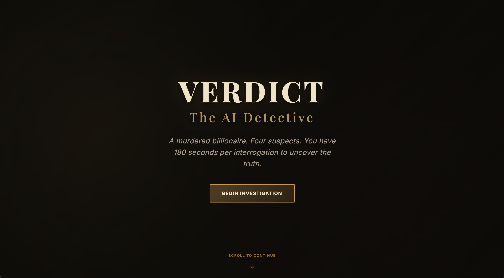
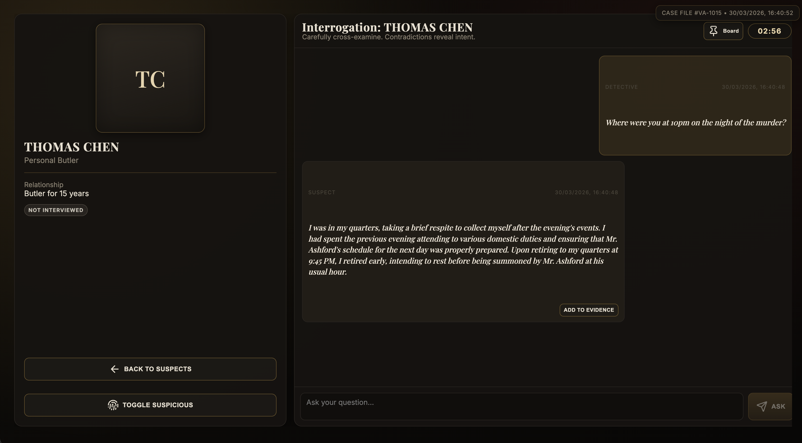
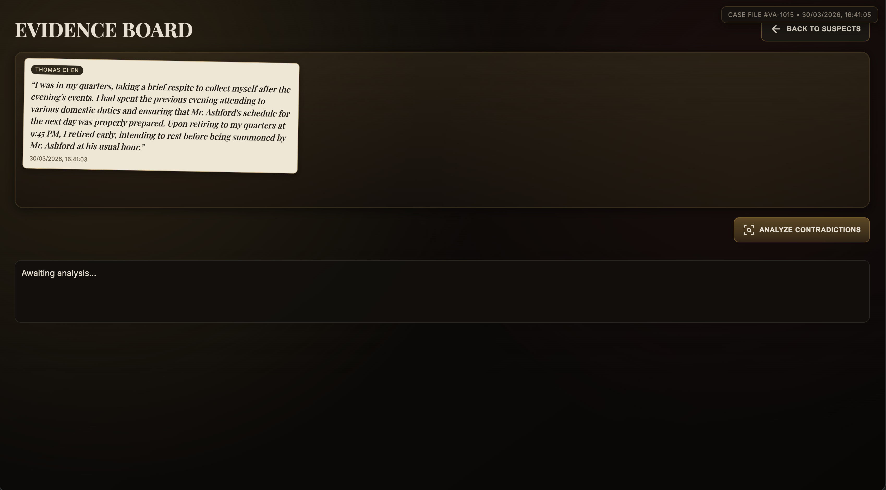
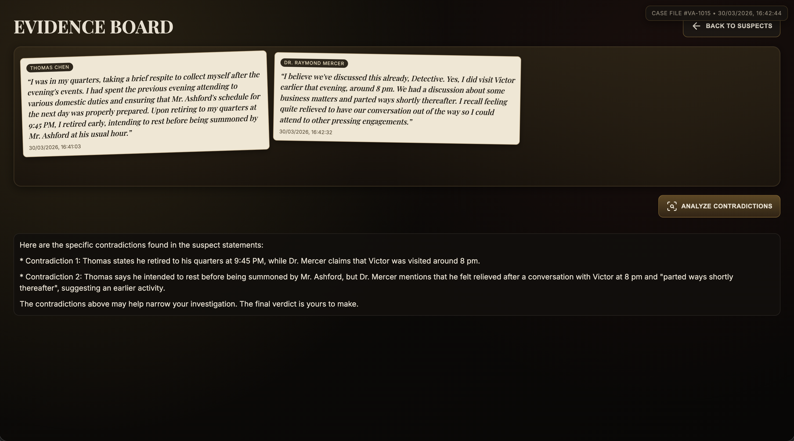
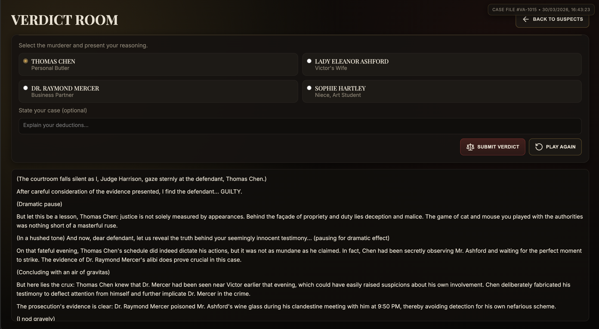
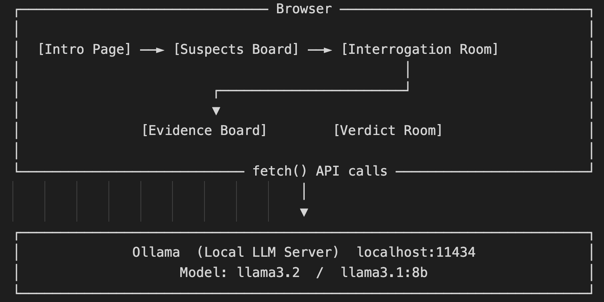

# VERDICT: The AI Detective

> A noir detective game powered by local AI. Interrogate suspects, collect evidence, and issue the final verdict.



---

## Table of Contents

- [VERDICT: The AI Detective](#verdict-the-ai-detective)
  - [Table of Contents](#table-of-contents)
  - [Overview](#overview)
  - [Demo Highlights](#demo-highlights)
    - [AI-Powered Interrogation](#ai-powered-interrogation)
    - [Evidence Board](#evidence-board)
    - [Contradiction Analysis](#contradiction-analysis)
    - [Verdict Room](#verdict-room)
    - [Gameplay Video Demo](#gameplay-video-demo)
  - [Architecture](#architecture)
    - [State Management](#state-management)
    - [AI Integration](#ai-integration)
  - [Features](#features)
  - [Tech Stack](#tech-stack)
  - [Getting Started](#getting-started)
    - [Prerequisites](#prerequisites)
    - [Step 1 — Install and start Ollama](#step-1--install-and-start-ollama)
    - [Step 2 — Pull the language model](#step-2--pull-the-language-model)
    - [Step 3 — Run the game](#step-3--run-the-game)
  - [Game Rules](#game-rules)
  - [The Suspects](#the-suspects)
  - [Future Improvements](#future-improvements)
  - [License](#license)

---

## Overview 

**VERDICT: The AI Detective** is a browser-based murder mystery game built for **[Hackiethon 2026](https://devpost.com/software/verdict-the-ai-detective#updates)**.

The core idea is simple: replace static branching dialogue with a real local AI. Every suspect is driven by a carefully engineered system prompt, giving each one a distinct personality, a hidden alibi, and a lie they will defend under pressure.

The player takes on the role of a detective investigating the death of **Victor Ashford**, a wealthy businessman found poisoned in his study. Four suspects. One killer. One chance to get the verdict right.

---

## Demo Highlights

### AI-Powered Interrogation
Each suspect responds dynamically to any question the player asks. The AI stays in character, maintains its lie, and subtly shifts its story when pressured.



### Evidence Board
Players collect key statements and build a case visually. Nothing is pre-scripted — the evidence board fills with real AI-generated responses.



### Contradiction Analysis
A dedicated AI analysis pass compares collected evidence across suspects and surfaces factual inconsistencies — without revealing the killer.



### Verdict Room
One final accusation. The AI judge evaluates the player's collected evidence and delivers a dramatic ruling.



---

### Gameplay Video Demo

[](https://www.youtube.com/watch?v=lyMsVA5Z9v0)

> Click the thumbnail above to watch the full gameplay demo.

## Architecture


### State Management

All game state is stored in a single global `gameState` object:

```javascript
const gameState = {
  suspects: {
    thomas:  { interviewed: false, suspicious: false, timerRemaining: 180 },
    eleanor: { interviewed: false, suspicious: false, timerRemaining: 180 },
    mercer:  { interviewed: false, suspicious: false, timerRemaining: 180 },
    sophie:  { interviewed: false, suspicious: false, timerRemaining: 180 }
  },
  evidence: [],
  interviewCount: 0
}
```

### AI Integration

Each suspect has an isolated system prompt defining:
- Character background and personality
- A hidden secret they protect
- A specific lie they will always maintain
- Speech style and behavioural cues

```javascript
// Simplified API call structure
const response = await fetch('http://localhost:11434/api/chat', {
  method: 'POST',
  headers: { 'Content-Type': 'application/json' },
  body: JSON.stringify({
    model: 'llama3.2',
    messages: [
      { role: 'system', content: suspectSystemPrompt },
      ...conversationHistory,
      { role: 'user', content: playerQuestion }
    ],
    stream: false,
    options: { num_predict: 200 }
  })
})
```

---

## Features 

- **4 AI suspects** — each with a unique personality, alibi, and hidden lie
- **Per-suspect conversation history** — the AI remembers what was said earlier in the same interrogation
- **Independent interrogation timers** — 3 minutes per suspect, paused when leaving the room
- **Evidence board** — collect and review key AI-generated statements
- **Contradiction analysis** — AI reviews collected evidence for inconsistencies without revealing the killer
- **One-shot verdict system** — the player makes a single final accusation
- **Noir UI** — dark atmospheric design with gold accent typography
- **Fully local** — no internet required after setup, no API costs, no data sent externally

---

## Tech Stack

| Layer | Technology |
|---|---|
| Frontend | HTML, CSS, JavaScript (Vanilla) |
| AI Runtime | Ollama (local LLM server) |
| Language Model | llama3.2 |
| Fonts | Google Fonts — Playfair Display, Inter |
| Icons | Inline SVG |
| Hosting | Local file / Python HTTP server |

---

## Getting Started

### Prerequisites

- [Ollama](https://ollama.com) installed on your machine
- A modern browser (Chrome, Firefox, Safari)
- No Node.js, no backend, no API keys required

### Step 1 — Install and start Ollama

```bash
ollama serve
```

### Step 2 — Pull the language model

```bash
ollama pull llama3.2
```

This will take approximately 5 minutes on the first run.

### Step 3 — Run the game

Option A — Open directly in browser:
Open index.html in your browser

Option B — Run with a local server:
```bash
python3 -m http.server 8000
```
Then visit `http://localhost:8000`

---

## Game Rules

1. **Interrogate** — Enter each suspect's room and question them freely. Each session is 3 minutes. The timer starts on your first question.
2. **Collect Evidence** — Save important responses to your evidence board using the ADD TO EVIDENCE button.
3. **Analyze** — Use the ANALYZE CONTRADICTIONS feature to surface inconsistencies across suspect statements.
4. **Verdict** — Interview at least 2 suspects to unlock the ISSUE VERDICT button. You have one accusation. Choose carefully.

---

## The Suspects

| Name | Role | Personality |
|---|---|---|
| Thomas Chen | Personal Butler (15 years) | Formal, loyal, over-explains when nervous |
| Lady Eleanor Ashford | Victor's Wife | Cold, precise, deflects with composure |
| Dr. Raymond Mercer | Business Partner | Aggressive, uses legal language, counter-questions |
| Sophie Hartley | Niece, Art Student | Educated but anxious, fragments under pressure |

---

## Future Improvements

- Randomised case generation — different killer each playthrough
- Stronger suspect memory — AI recalls specific earlier statements
- Voice synthesis for suspect responses
- Mobile-optimised layout
- Save and resume case progress
- Multiple difficulty levels affecting how well suspects conceal lies

---

## License

**This project is for educational and portfolio purposes.**
